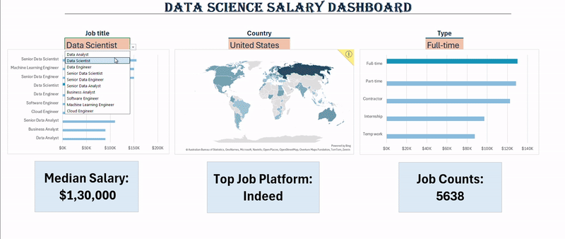

# Data sciendce salary dashboard
This dashboard contains the visulaisation and analysis of the data science job salary and all the requirements needed to get the job along with what parameters take more job in where and how much is the demand of different titles in the different regoin.

---

---

## Topics required to build 
- Basic excel
- Data manipulation
- Sheet and workbook handling
- Ribbons
- Formulas
- Function
- Charts & Maps
- Advanced Spreadsheet
- Formatting 
- Tables
- Collaboration
- Customisation
- Lookups
- Security & locking
- Key performance indicator(KPI)

---
  
---

## Specialisation & Aim
- Helps to find the Job requiremnts based on vaiours categories
- Which is most demanding job according to the region
- Trending jobs in the time
- Secure from other users & co-workers
- Visually represented data
- BI analysis using excel
- Estimate salary according to the profession

---

## How to use the Excel File?
- First download the "Raw File" 
- Open the excel file And click "Autosave"
- Right click on the sheet
- Unhide all the sheets
- Analyse how things are calculated
- Now do practice according to you 
- Push your progress to Git Hub(imp)

---