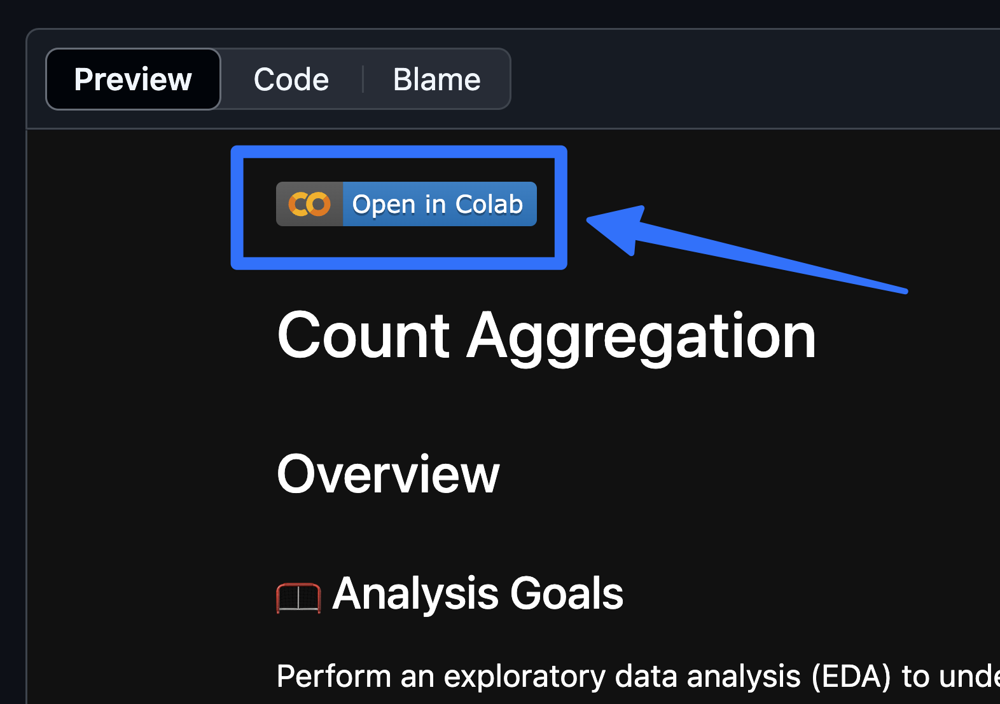

# 📊 Intermediate SQL for Data Analytics - Full Course
## Introduction
📊 Dive into the data job market! Focusing on Contoso 100k Database, this project explores 💰 customer segmentation, 🔥 cohort analysis, and 📈 which are retention customers.

## The Questions I want to answer from my SQL queries?
- What is the Contosso 100k database?
- How to do segmentations on the customers?
- How to make cohort analysis on the customer data?
- What are the most returning customers to the service?

## Table of Contents
### 1. Pivot With Case Statements

 - [Basic Aggregation](1_Pivot_With_Case_Statement/1_Basic_Aggregation.ipynb)
 - [Statistical Aggregations](1_Pivot_With_Case_Statement/2_Statistical_Aggregations.ipynb)
 - [Advanced Segmentation](1_Pivot_With_Case_Statement/3_Advanced_Segmentation.ipynb)

### 2. Date Time

 - [Date Format](2_Date_&_Time/1_Date_Format.ipynb)
 - [Date Filtering](2_Date_&_Time/2_Date_Filtering.ipynb)
 - [Date Differences](2_Date_&_Time/3_Date_Differences.ipynb)

### 3. Windows Functions

 - [Syntax](3_Windows_Function/1_Syntax.ipynb)
 - [Aggregation](3_Windows_Function/2_Aggregation.ipynb)
 - [Ranking](3_Windows_Function/3_Ranking.ipynb)
 - [Lag Lead](3_Windows_Function/4_Lag_Lead.ipynb)
 - [Frame Clause](3_Windows_Function/5_Frame_Clause.ipynb)

### 4. Views

 - [View Intro](4_Views/1_View_Intro.ipynbb)
 - [Project Cohort Revenue](4_Views/2_Project_Cohort_Revenue.ipynb)

### 5. Data Cleaning

 - [Conditional Handle Nulls](5_Data_Cleaning/1_Conditional_Handle_Nulls.ipynb)
 - [String Formatting](5_Data_Cleaning/2_String_Formatting.ipynb)
 - [Project Customer Segmentation](5_Data_Cleaning/3_Project_Customer_Segmentation.ipynb)

### 6. Query Optimization

 - [Explain Intro](6_Query_Optimisation/1_Explain_Intro.ipynb)
 - [Optimization Techniques](6_Query_Optimisation/2_Optimization_Techniques.ipynb)
 - [Project Customer Retention](6_Query_Optimisation/3_Project_Customer_Retention.ipynb)

### 7. Project

 - [Create View](Project/0_create_view.sql)
 - [Customer Segmentation](Project/1_customer_segmentation.sql)
 - [Cohort Analysis](Project/2_cohort_analysis.sql)
 - [Retention Analysis](Project/3_retention_analysis.sql)

## How to Run SQL Files
### Method 1️⃣: Run in Google Colab
> Recommended to start if newby.
#### Prerequisites:
- Google Account

#### Steps:
1. Click the "Open in Colab" button at top of any notebook.  

2. Run all cells in the notebook.   
   
---

### Method 2️⃣: Run Database Locally w/ PGAdmin
> Second half of course uses this method.
#### Prerequisites:
- [PostgreSQL Installed](https://www.postgresql.org/download/)
- [pgAdmin Installed](https://www.pgadmin.org/download/)

#### Steps:
1. Download the [Contoso database](https://github.com/lukebarousse/Int_SQL_Data_Analytics_Course/releases).
2. Open pgAdmin 4.
3. In Object Explorer, connect to your PostgreSQL server.
4. Right-click on "Databases" > "Create" > "Database...".  
5. Enter `contoso_100k`for "Database" and click "Save".
6. In Object Explorer, right-click on the `contoso_100k` database > "PSQL Tool".
7. In the PSQL Tools Window, enter `\i [path to contoso_100k.sql]` and press enter.
> ```
> \i '/Users/Desktop/contoso_100k.sql'
> ```
8. If necessary, in the Query Tool, set default password for the `postgres` user to `password`.  
 **⚠ If you have sensitive information in your server DO NOT do this step; also not required if this is already your password ⚠️**
> ```
> ALTER USER postgres WITH PASSWORD 'password';
> ```
---
### Method 3️⃣: Run SQL Locally in Jupyter Notebook
> How Kelly & I built the course; not recommended for beginners.
#### Prerequisites:
- [PostgreSQL Installed](https://www.postgresql.org/download/)
- [Anaconda Installed](https://www.anaconda.com/products/distribution)
- Database Running Locally

#### Steps:
1. Create a new conda environment with `ipykernel`, `pandas`, and `matplotlib`:
> ```
> conda create -n sql_course python=3.11 ipykernel pandas matplotlib
> ```
2. Activate the environment:
> ```
> conda activate sql_course
> ```
3. Install the `jupysql` and `psycopg2` packages:
> ```
> conda install -c conda-forge jupysql psycopg2
> ```
4. Upgrade `jupysql`, necessary due to [this issue](https://github.com/ploomber/jupysql/issues/1038):
> ```
> pip install --upgrade jupysql
> ```
5. Activate the `sql_course` environment in the notebook.

## Resources & Credits
- This repository contains learning inspired by the repository   
[SQL for data Analytics](https://github.com/lukebarousse/Int_SQL_Data_Analytics_Course.git)   
- The Data set which is used is in the Google Colab: [Open Colab](https://colab.research.google.com/github/lukebarousse/Int_SQL_Data_Analytics_Course/blob/main/Resources/Blank_SQL_Notebook.ipynb#scrollTo=ngBi0AcCbQpO)
- Refer [POSTGRE Documentations For time zones](https://www.postgresql.org/docs/current/datatype-datetime.html#DATATYPE-TIMEZONES)
- This SQL course helps me alot to learn SQL fundamentally through understanding all the concepts.
All Thanks to Sir [Luke Barousse](https://www.linkedin.com/in/luke-b) 
[](https://www.youtube.com/watch?v=QKIGsShyEsQO)


## Found a Typo? Want to Contribute?
- If you find an error in this repo, please feel free to make a pull request by:
    - Forking the repo
    - Making any changes
    - Submitting a pull request

## ✅ Conclusions
### 📊 Insights

From the analysis of the Intermediate SQL repository, several key insights emerged:

- Strong Foundation in SQL Concepts: The repository covers essential to advanced SQL topics such as joins, subqueries, aggregations, and window functions, building a solid analytical foundation.
- Importance of Query Optimization: Techniques like indexing, query execution analysis, and performance tuning highlight how efficient queries are crucial for handling large datasets.
- Data Cleaning is Critical: Handling missing values, duplicates, and outliers shows that data preparation is a major step before performing analysis.
- Advanced SQL for Deeper Insights: Concepts like Common Table Expressions (CTEs) and window functions enable more complex and meaningful data analysis.
-Real-World Problem Solving: Practical queries and case-based analysis demonstrate how SQL is used to extract insights and support decision-making in real scenarios.

- 🧠 Closing Thoughts

This project helped me strengthen my intermediate SQL skills by working on real-world queries and analytical problems. It improved my understanding of data manipulation, cleaning, and optimization techniques. The repository reflects how SQL is not just for data retrieval but also for performing complete data analysis. Overall, this experience enhanced my problem-solving ability and prepared me for real-world data analyst tasks.