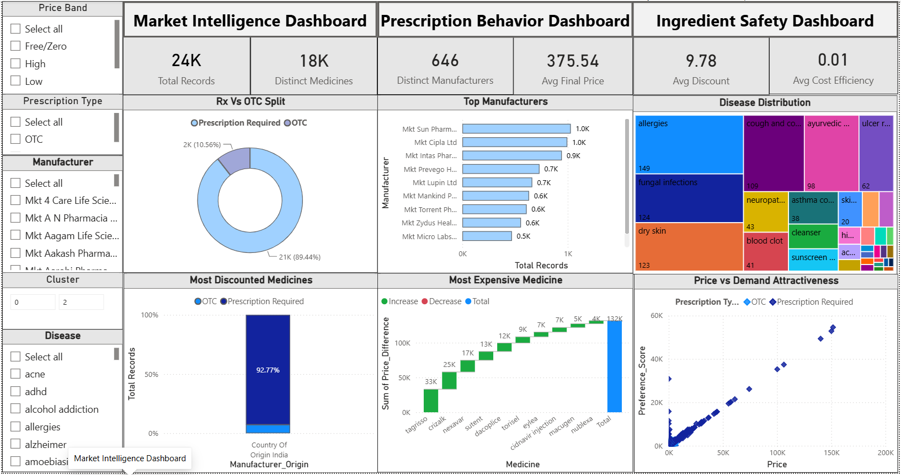

# 💊 Pharmaceutical Products & Market Analysis using NLP and Power BI

## 📌 Project Overview

This project demonstrates an end-to-end Data Analytics workflow by transforming raw pharmaceutical product data into interactive business intelligence dashboards.

The project combines Data Cleaning, Natural Language Processing (NLP), Feature Engineering, Exploratory Data Analysis (EDA), and Power BI Dashboard Development to generate actionable business insights for pharmaceutical products.

Instead of analyzing only structured numerical data, this project extracts meaningful information from unstructured drug descriptions using NLP techniques before visualizing the results inside Power BI.

---

# 🚀 Project Workflow

Raw Pharmaceutical Dataset

⬇

Data Cleaning & Preprocessing

⬇

NLP Information Extraction

⬇

TF-IDF Keyword Extraction

⬇

Feature Engineering

⬇

Exploratory Data Analysis

⬇

Power BI Dashboard

⬇

Business Insights

---

# 📊 Project Objectives

- Clean and preprocess pharmaceutical datasets
- Extract structured information from unstructured drug descriptions
- Perform NLP-based text processing
- Engineer analytical features
- Analyze pharmaceutical products and prescriptions
- Create interactive Power BI dashboards
- Generate business-driven insights

---

# 🛠️ Tech Stack

### Programming

- Python

### Libraries

- Pandas
- NumPy
- Regular Expressions (Regex)
- NLTK
- spaCy
- Scikit-learn (TF-IDF)
- Matplotlib
- Seaborn

### Visualization

- Power BI Desktop

### Development Environment

- Jupyter Notebook

---

# 📂 Project Structure

Pharmaceutical-Products-Analysis/  
│  
├── Data/  
│ ├── pharma_products_full_features.csv  
│ └── clean_data.csv  
│  
├── Notebook/  
│ └── pharma_analysis.ipynb  
│  
├── Dashboard/  
│ └── Dashboard.pbix  
│  
├── Images/  
│ ├── Dashboard1.png  
│ ├── Dashboard2.png  
│ ├── Dashboard3.png  
│  
│  
├── README.md  
│  
└── requirements.txt  

---

# 📖 Dataset Features

The dataset contains pharmaceutical information including:

- Drug Name
- Disease Name
- Manufacturer
- Ingredients
- Drug Description
- Side Effects
- Warnings
- Dosage
- Prescription Requirement
- Price
- Discount
- Product Rating
- Drug Interactions

After preprocessing, additional analytical features were engineered such as:

- Ingredient Count
- Side Effect Count
- Keyword Count
- Risk Score
- Prescription Indicator
- Discount Percentage
- Price Difference
- Preference Score
- Complexity Score

---

# 🧹 Data Cleaning

The dataset was cleaned using Python.

### Cleaning Steps

✔ Removed duplicate records

✔ Handled missing values

✔ Standardized text formatting

✔ Removed unwanted symbols

✔ Converted text to lowercase

✔ Cleaned ingredient names

✔ Cleaned disease names

✔ Normalized prescription information

---

# 🧠 NLP Pipeline

The project uses rule-based Natural Language Processing.

### Information Extracted

- Drug Uses
- Dosage
- Side Effects
- Warnings
- Drug Interactions

### Techniques Used

- Regular Expressions (Regex)
- Text Normalization
- Tokenization
- TF-IDF Keyword Extraction

---

# ⚙️ Feature Engineering

Several business-oriented features were created including:

- Discount %
- Ingredient Count
- Side Effect Count
- Keyword Count
- Risk Score
- Preference Score
- Complexity Score
- Prescription Required
- High Risk Indicator

These engineered features significantly improved downstream analytics and dashboard capabilities.

---

# 📈 Exploratory Data Analysis (EDA)

Python was used to explore:

- Drug Distribution
- Disease Distribution
- Manufacturer Analysis
- Prescription Analysis
- Pricing Trends
- Discount Analysis
- Ingredient Analysis
- Safety Analysis

---

# 📊 Power BI Dashboard

The project contains three fully interactive dashboards.

## 1️⃣ Market Analysis Dashboard

Focuses on

- Product Distribution
- Market Pricing
- Discount Analysis
- Manufacturer Performance
- Product Categories  

---

## 2️⃣ Prescription Analysis Dashboard

Focuses on

- Prescription vs OTC
- Disease-wise Prescriptions
- Manufacturer Analysis
- Risk Analysis
- Medicine Preference
- Prescription Patterns  

---

## 3️⃣ Medicine Ingredient Analysis Dashboard

Focuses on

- Ingredient Frequency
- Ingredient Distribution
- Side Effects
- Drug Complexity
- Risk by Ingredient
- Ingredient Network  

---

# 📌 Dashboard Features

✔ Interactive Slicers

✔ Cross Filtering

✔ Navigation Buttons

✔ Dynamic KPIs

✔ Tooltips

✔ Responsive Dashboard Design

---

# 💼 Business Insights Generated

The dashboard helps answer questions like:

- Which manufacturers dominate the market?
- Which medicines require prescriptions?
- Which diseases have the highest prescription demand?
- Which ingredients appear most frequently?
- Which medicines carry higher safety risks?
- Which products offer higher discounts?
- Which manufacturers produce high-risk medicines?
- Which ingredient combinations are most common?

---

# 📚 Skills Demonstrated

## Data Analytics

- Data Cleaning
- Data Wrangling
- Feature Engineering
- Exploratory Data Analysis

## Python

- Pandas
- NumPy
- Regex
- NLP
- TF-IDF

## Data Visualization

- Power BI
- Dashboard Design
- KPI Development
- Storytelling
- Business Intelligence

## Business Analysis

- Market Analysis
- Prescription Analysis
- Ingredient Analysis
- Decision Support

---

# 🎯 Key Learnings

This project significantly strengthened my practical Data Analytics skills by providing hands-on experience in:

- Cleaning real-world pharmaceutical datasets
- Building NLP pipelines for information extraction
- Engineering analytical features
- Performing business-focused exploratory analysis
- Designing interactive Power BI dashboards
- Transforming raw data into actionable business insights

---

# 🚀 Future Improvements

- Machine Learning for drug recommendation
- Predictive pricing models
- Sentiment analysis on drug reviews
- Automated dashboard refresh
- SQL database integration
- Azure deployment
- Power BI Service publishing

---

# 👨‍💻 Author

**Ansh Jaiswal**

Computer Science & Engineering (Data Science)

Passionate about

- Data Analytics
- Power BI
- Python
- Business Intelligence
- Data Visualization

---

## 📜 License
This project is protected under intellectual property rights.  
ALong with the government approval copyright and patent with the year of 2026.  
Unauthorized use or redistribution is prohibited, if done then the strict Action will be taken.

---

⭐ If you found this project interesting, consider giving it a star.